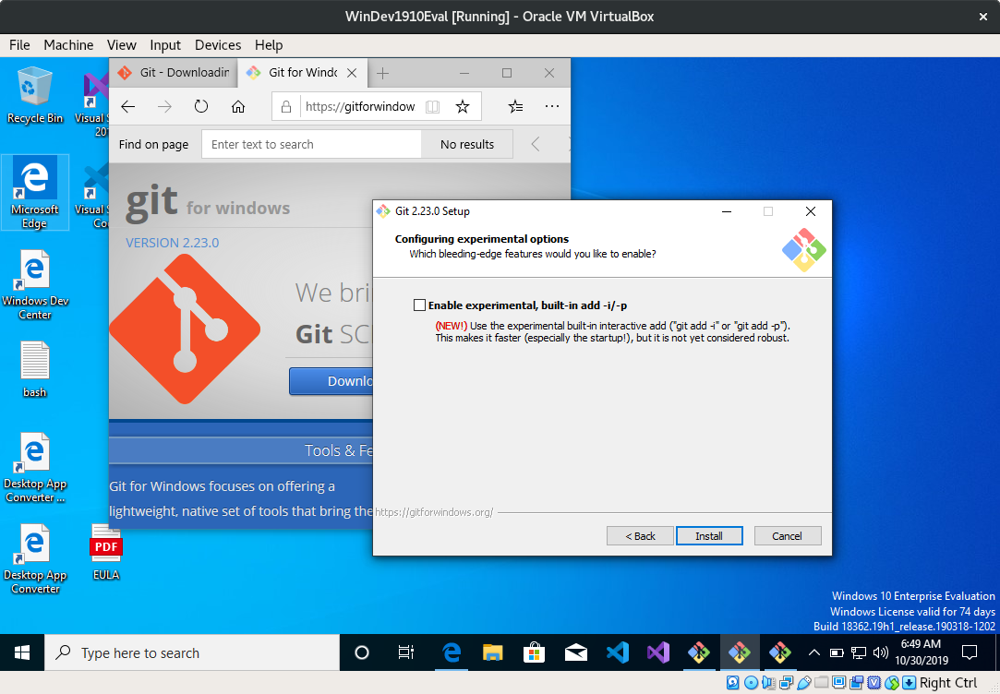

# Notes on carpentry lessons

Can we get a GitBash. Can we get a Windows, first.

* [https://developer.microsoft.com/en-us/windows/downloads/virtual-machines](https://developer.microsoft.com/en-us/windows/downloads/virtual-machines)

The VirtualBox version:
[https://aka.ms/windev_VM_virtualbox](https://aka.ms/windev_VM_virtualbox) -
This VM will expire on 1/12/20.

* Windows 10 1903 and the Windows 10 SDK, version 1903 (10.0.18362.1)
* Visual Studio 2019 with the UWP, .NET desktop, and Azure workflows enabled and also includes the Windows Template Studio extension
* Visual Studio Code
* Windows Template Studio extension
* Windows UWP samples (latest)
* Windows Subsystem for Linux enabled with Ubuntu installed
* Developer mode and bash enabled

## Editor

* Visual Studio Code is currently (2019) a good cross platform option.

Other options:

* [Notepad++](https://notepad-plus-plus.org/downloads/) (Windows)
* [Gedit](https://wiki.gnome.org/Apps/Gedit) (Linux)

## Git installation on Windows 10

* Version used: [Git-2.23.0-32-bit.exe](https://github.com/git-for-windows/git/releases/download/v2.23.0.windows.1/Git-2.23.0-32-bit.exe)

For more questions, the default will be fine. As a nice, open source cross platform editor, we recommend

* [Visual Studio Code](https://code.visualstudio.com/)

### Git editor options

### Git path option

### Git HTTPS options

### Git line endings

### Git terminal emulator

### Git extras

### Git experimental features

### Git wrap up

### Git version and config options

----

# 2020-09-21-LC_IG_WBS_online

* Veränderungen von MD
* "nicht immer mit möglich"
* GitHub/GitLab

Visual walkthrough, push, pull, fork, merge.
