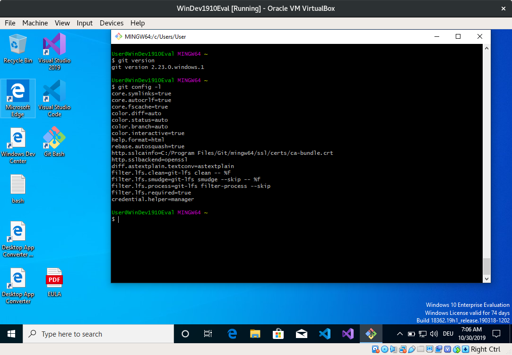

# Library Carpentry Extra Content

Some additional material for [library carpentry](https://librarycarpentry.org/)
workshop, prepared for [2019-11-04 Workshop](https://ubleipzig.github.io/2019-11-04-leipzig/).

# Introductory slides

* [Slides](https://docs.google.com/presentation/d/1ifZE-cZSrZQICVZQWfzcvVdsUhnS0uOgtCdxnpJO3a0/edit#slide=id.p)

# A Microsoft Windows (TM) Virtual Machine

* [https://developer.microsoft.com/en-us/windows/downloads/virtual-machines](https://developer.microsoft.com/en-us/windows/downloads/virtual-machines)

The VirtualBox version:
[https://aka.ms/windev_VM_virtualbox](https://aka.ms/windev_VM_virtualbox) - This VM will expire on 1/12/20.

```
a69ca4063dabf3fae881d891f28221c574eebce3  vm/WinDev1910Eval.ova
```

* Windows 10 1903 and the Windows 10 SDK, version 1903 (10.0.18362.1)
* Visual Studio 2019 with the UWP, .NET desktop, and Azure workflows enabled and also includes the Windows Template Studio extension
* Visual Studio Code
* Windows Template Studio extension
* Windows UWP samples (latest)
* Windows Subsystem for Linux enabled with Ubuntu installed
* Developer mode and bash enabled

# Git Use Cases in GLAM

## Git Use Cases at Leipzig University Library and SLUB

* Software, [VuFind](https://github.com/vufind-org/vufind)
  ([Contributors](https://github.com/vufind-org/vufind/graphs/contributors)),
  [Kitodo](https://github.com/kitodo/kitodo-presentation), Typo3-Plugins. e.g.
  [Raumbuchung/Typo3 ](https://github.com/ubleipzig/tx-booking), Specifications,
  e.g. [intermediate schema](https://github.com/ubleipzig/intermediateschema),
  Tools, e.g. [solrdump](https://github.com/ubleipzig/solrdump), an [URN
  library](https://github.com/slub/urnlib), Documentation, e.g.
  [Papers](https://github.com/miku/siskin/blob/master/docs/tr-dilmmf/tr-dilmmf.tex)
  (LaTeX) or [presentations](https://github.com/miku/siskin/blob/master/docs/ai-overview/slides.md), Jupyter Notebooks, e.g. [Coding da Vinci Input Session](https://github.com/miku/sundaypython), [CSV example](https://github.com/miku/sundaypython/blob/master/notebooks/04%20Working%20with%20CSV.ipynb), Community, e.g. [BibsOnGitHub](https://github.com/hbunke/BibsOnGitHub), ...
* [List of Tools and Project](https://github.com/ubleipzig/awesome-library), [RSE](https://github.com/ubleipzig/awesome-rse), [Scholarly Data Analysis](https://github.com/napsternxg/awesome-scholarly-data-analysis)

# Git installation on Windows 10

* Version used: [Git-2.23.0-32-bit.exe](https://github.com/git-for-windows/git/releases/download/v2.23.0.windows.1/Git-2.23.0-32-bit.exe)

For more questions, the default will be fine. As a nice, open source cross platform editor, we recommend

* [Visual Studio Code](https://code.visualstudio.com/)

## Git editor options


## Git path option


## Git HTTPS options


## Git line endings


## Git terminal emulator


## Git extras


## Git experimental features


## Git wrap up


## Git version and config options



